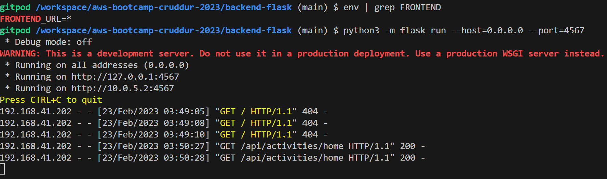

# Week 1 — App Containerization
## Benefits of App Containerization
    - Makes your application more portable: other developers can pick up your code and work with them on the go as opposed to configuring the setup
    - Allows you to be closer to the environment you are deploying
    - In Dev/Test environments, containers allow you to keep the environment maintained and free from errors. You may have different variants of OS, modules and configs

## Step 1: Download the Docker extention on VS Code
- Create a Dockerfile
- Template can be found in the repo [repo](https://github.com/omenking/aws-bootcamp-cruddur-2023/blob/week-1/journal/week1.md#add-dockerfile)
- The commands provided above indicate that the container will execute in a specific folder named ‘backend-flask’, as specified by the ‘WORKDIR /backend-flask’ command.
- Try to run the python command, if you havent set the env vars, you should get a 404 error
- Set env vars by doing the following:
    - ```export FRONTEND_URL="*" ```
    - ```export BACKEND_URL="*" ```
- After setting the env vars, run the python command & add ```sh /api/activities/home``` to the end of the URL
    - Terminal Output -> 
    - Browser Output -> 
    Ctrl + C to kill server

---------------	---------------	---------------	---------------	
## Step 2: Unset the URL's
- Use the ```unset``` command to unset the BACKEND_URL & FRONTEND_URL
Navigate to your project dir and run ```docker build -t  backend-flask ./backend-flask```

- You should see ```Successfully built e39facc0f80c
Successfully tagged backend-flask:latest```

- Run the command ```sh docker run --rm -p 4567:4567 -it backend-flask```
    > I encountered an error *Docker - Bind for 0.0.0.0:4567 failed: port is already allocated*
    - The cause: Previous container launched was killed
        - The fix: Killed prev launched container by
            - docker container ls
            - copy the container id
            - docker stop {container id}
- Enter the following in terminal
    docker run --rm -p 4567:4567 -it -e FRONTEND_URL='*' -e BACKEND_URL='*' backend-flask
- Open new terminal and run docker ps

## Step 3: Containerize Frontend & Backend
- Navigate to the frontend directory from the terminal and type "npm install"
- While that is being installed, create a Dockerfile and copy the contents from [repo](https://github.com/omenking/aws-bootcamp-cruddur-2023/blob/week-1/journal/week1.md#create-docker-file)
- Create a docker-compose.yaml and copy the contents from [here](https://github.com/omenking/aws-bootcamp-cruddur-2023/blob/week-1/journal/week1.md#create-a-docker-compose-file)
- Right-click on the docker-compose file and click "Compose Up"
    - Remember to kill the container else you would get ```Docker - Bind for 0.0.0.0:4000 failed: port is already allocated```
- Clean up! -> Stop all the containers!

## Step 4: Added notification feature
- To begin, right click on the docker-compose.yaml
    - You may run into a problem where clicking on port 3000 throws an error. To fix the error, run ```npm i``` in the /frontend-react-js folder
    - You can also add the following to the gitpod.yml:
    ```js
    - name: npm-install
    init: |
      cd /workspace/aws-bootcamp-cruddur-2023/frontend-react-js
      npm i
      exit
- Next: Add an endpoint for our notifications
    - Open the openapi-3.0.yml document and add a new path
        ```yml
        /api/activities/notifications:
        get:
      description: 'Return a feed of activities for all followers and the people I follow'
      tags:
          - activities
      parameters: []
      responses:
        '200':
          description: 'Returns array of activities'
          content:
            application/json:
              schema:
                type: array
                items:
                  $ref: '#/components/schemas/Activity'
        ```
    - The endpoint into our app can be found in the app.py file
    - In app.py, add a new route: /api/home/notifications
        - Refer to this video: [SetUp Frontend & Backend](https://www.youtube.com/watch?v=k-_o0cCpksk&list=PLBfufR7vyJJ7k25byhRXJldB5AiwgNnWv&index=27)

## Step 5: Add dynamoDb & PostGres
- We are going to add some code to our docker-compose.yaml to spin up DynamoDb & Postgres
- If you navigate to the AWS docs for DynamoDB local > Docker code and add it into your yaml file
- DynamoDB local is a way of working with DynamoDB
- We might have to change the ports as well. Add the following to your yaml file
    ```yml
        db:
    image: postgres:13-alpine
    restart: always
    environment:
      - POSTGRES_USER=postgres
      - POSTGRES_PASSWORD=password
    ports:
      - 5432:5432
    volumes:
      - db:/var/lib/postgresql/data
  dynamodb-local:
    user: root
    command: -jar DynamoDBLocal.jar -sharedDb -dbPath ./data
    image: amazon/dynamodb-local:latest
    container_name: dynamodb-local
    ports:
      - 8000:8000
    volumes:
      - ./docker/dynamodb:/home/dynamodblocal/data
    working_dir: /home/dynamodblocal
        ```
- PostGres by default uses port 5432. You may encounter an error with the yaml file. This might happen because of poorly formatted code, so use a Yaml validator. 
    - [Yaml Validator](https://www.yamllint.com/) -> be sure to not include sensitive info
- To work, Postgres needs a client. So we're going to add the following in our .gitpod.yml:
    ```yaml
    - name: postgres
    init: |
      curl -fsSL https://www.postgresql.org/media/keys/ACCC4CF8.asc|sudo gpg --dearmor -o /etc/apt/trusted.gpg.d/postgresql.gpg
      echo "deb http://apt.postgresql.org/pub/repos/apt/ `lsb_release -cs`-pgdg main" |sudo tee  /etc/apt/sources.list.d/pgdg.list
      sudo apt update
      sudo apt install -y postgresql-client-13 libpq-de
    ```
